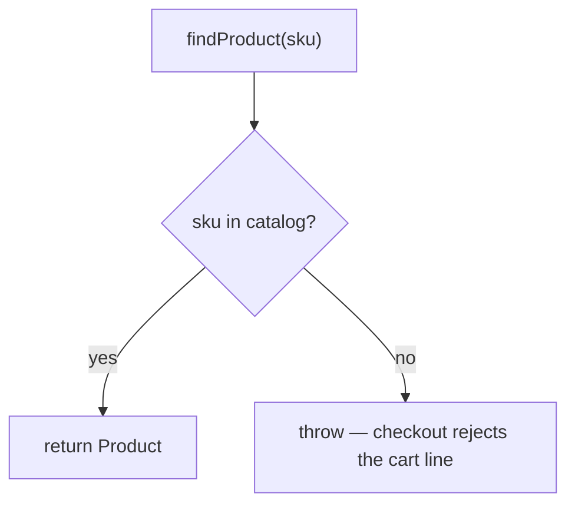

# Product catalog

The catalog is a hard-coded array of `Product` in `src/pos.ts` (a real system would load
this from a database).

```ts
interface Product { sku: string; name: string; price: number; }
```

`findProduct(sku)` looks a product up by SKU and **throws** on an unknown SKU — checkout
relies on that to reject bad cart lines early.



## See also
- [checkout.md](checkout.md) — consumes `findProduct` to build invoice lines
