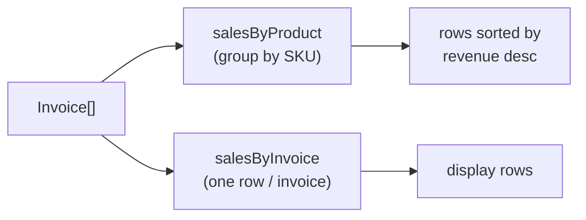

# Reports

Two read-side reports over the invoices produced by checkout. All code in `src/reports.ts`.
Both take `Invoice[]` — see [../pos-flow/checkout.md](../pos-flow/checkout.md) for that shape.

## When to apply

Read before changing aggregation logic, adding a report, or debugging a number that
disagrees with raw invoices.

## Index

| Report | Doc | Tags |
|--------|-----|------|
| Sale by product (qty + revenue per SKU) | [sales-by-product.md](sales-by-product.md) | sales-by-product, revenue, aggregation |
| Sale by invoice (one row per invoice) | [sales-by-invoice.md](sales-by-invoice.md) | sales-by-invoice, invoice |
