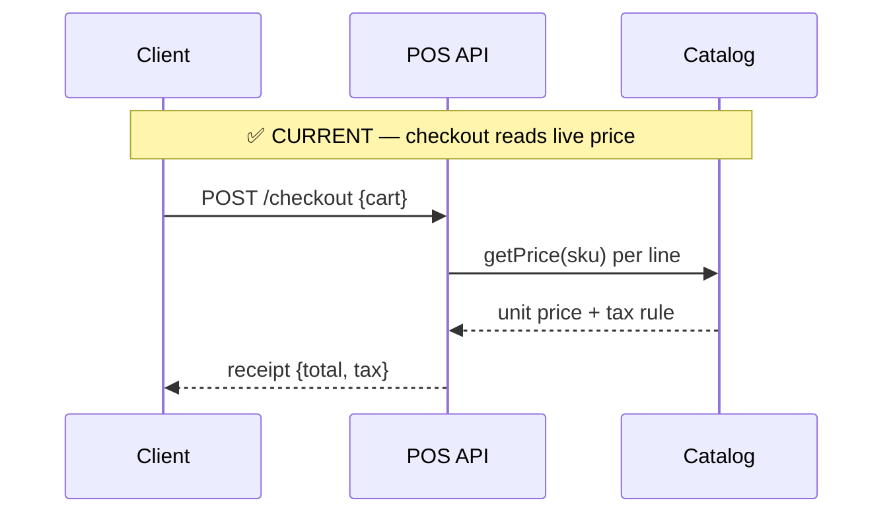

# Diagrams in skills (mermaid)

Skills are read fast, mid-task. A diagram conveys a flow or structure quicker than a
paragraph, and the OKF site + GitHub both render mermaid natively. Parent:
[SKILL.md](SKILL.md).

## The rule

> Any doc that describes a **flow, sequence, architecture, state machine, or data
> movement** MUST include at least one mermaid diagram.

If the concept is a call order, an async/event hop chain, a decision tree, a pipeline, a
lifecycle, or how components connect — draw it. Pure reference lists (a field table, an
enum spec, a checklist) don't need one. When in doubt and the doc has arrows-in-prose
("A calls B, which emits C"), that's a diagram.

## Pick the type

| Use | For |
|-----|-----|
| `sequenceDiagram` | cross-service / async message flows, call ordering, request round-trips, queue hops |
| `flowchart` (`graph TD`/`LR`) | branching logic, decisions, pipelines, "how X is built" component maps |
| `stateDiagram-v2` | state machines / lifecycles (e.g. order status transitions) |
| `erDiagram` | table/entity relationships |

## Authoring

- Fence with ```` ```mermaid ```` so it renders on GitHub and the site.
- Put the diagram in the **leaf** where the concept lives; an index may carry one
  high-level overview diagram.
- Keep it to the essentials — a diagram that needs a legend to read has too much in it.
  Split rather than cram.

## Readability (learned the hard way)

- **Don't use `rect rgb(...)` background fills.** The light tints render as low-contrast
  grey text on dark-theme viewers (GitHub dark, the site) and become unreadable. Use
  `Note over A,B: ...` section headers instead, and status markers (✅ current / ⛔
  deprecated) in the note text.
- Let text render in the viewer's theme color — don't hard-code colors that only work in
  one theme.
- Prefer short participant aliases (`participant Q1 as SQS: app-install`) over long raw
  names that overflow the lane.

## Example (status-annotated sequence)



## See also

- [structure.md](structure.md) — where the diagram sits in the index/leaf layout.
- [checklist.md](checklist.md) — the pre-commit diagram gate.
